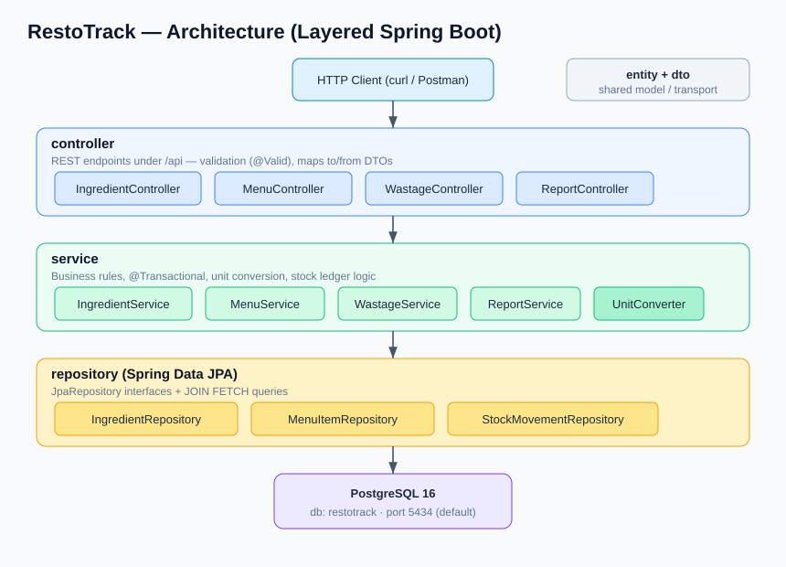
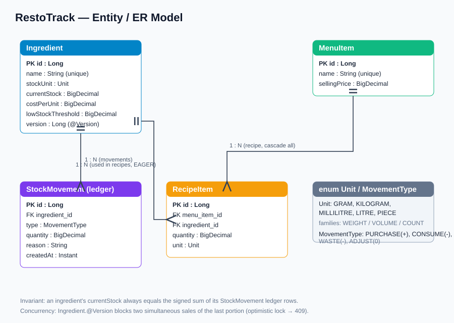
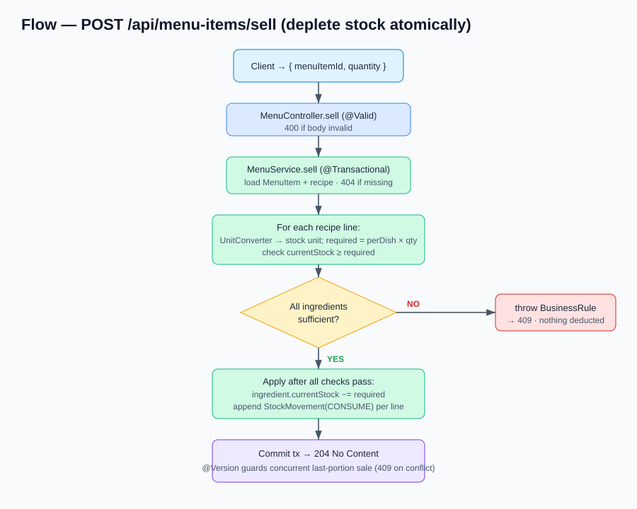

# RestoTrack — Restaurant Ingredient & Wastage Tracker

A backend-only service that helps a restaurant know its **true food cost** and **where ingredients are being lost**. Instead of tracking stock by hand, each dish is modelled as a recipe of ingredients; selling a dish automatically depletes those ingredients from stock, wastage is logged with a reason, and reports surface cost-per-dish and daily wastage.

## Problem it solves

Restaurants know what they sold but rarely know their real food cost or where stock leaks. RestoTrack links sales to ingredient consumption so the numbers reconcile automatically.

## Use cases

1. **Manage & restock ingredients** — create ingredients with a stock unit, cost, and low-stock threshold; restock them (with unit conversion, e.g. buy in grams, hold in kilograms).
2. **Sell a dish → auto-deplete stock** — define a menu item as a recipe; selling it deducts every recipe ingredient from stock atomically. A shortfall on any ingredient blocks the whole sale.
3. **Log wastage & view reports** — record wastage with a reason, and view daily wastage cost, cost-per-dish/margin, and low-stock alerts.

## Design highlights

- **Immutable stock-movement ledger** — stock is never edited ad hoc. Every change is a `StockMovement` (PURCHASE / CONSUME / WASTE / ADJUST); current stock equals the ledger sum.
- **Recipe as a bill of materials** — one sale fans out into multiple ingredient deductions.
- **Unit conversion** — recipe units are converted to each ingredient's stock unit within the same family (weight / volume / count); incompatible conversions are rejected.
- **Concurrency safety** — `Ingredient` carries a JPA `@Version` so two simultaneous sales of the last portion can't drive stock negative; the loser gets `409 Conflict` to retry.

## Diagrams

### Architecture

A layered Spring Boot service: `controller` → `service` → `repository` → PostgreSQL, with `entity` and `dto` as the shared model/transport types.



### Entity / ER model

Ingredients, dishes (menu items), recipe lines, and an append-only stock-movement ledger.



### Request flow — selling a dish

The most involved flow: a sale fans out into per-ingredient deductions, validates availability for all of them first, and only then applies the changes and appends the ledger rows.



## Tech stack

- Java 21, Spring Boot 3.3.5 (Web, Data JPA, Validation)
- PostgreSQL 16
- Gradle (wrapper included)
- Docker Compose (bundled Postgres for local runs)

## Getting started

The project is self-contained: a bundled Docker Compose file brings up its own PostgreSQL, so it does not depend on any pre-existing database.

1. Start the database (its own Postgres on port `5434`):
   ```powershell
   docker compose up -d
   ```
2. Run the app:
   ```powershell
   ./gradlew bootRun
   ```
   The API starts on `http://localhost:9091`. Schema is auto-created and seed ingredients are loaded on first run.

### Configuration

All connection settings are environment variables with sensible defaults, so nothing is hardcoded to another project:

| Variable | Default | Purpose |
|----------|--------|---------|
| `DB_HOST` | `localhost` | Database host |
| `DB_PORT` | `5434` | Database port |
| `DB_NAME` | `restotrack` | Database name |
| `DB_USER` | `restotrack` | Database user |
| `DB_PASSWORD` |  Database password |

Override any of them at runtime, e.g. to use a different port:
```powershell
./gradlew bootRun -DDB_PORT=5555
```

> API examples for every endpoint (curl + expected responses) live in [API-COLLECTION.md](API-COLLECTION.md).

## API

| Method | Path                                   | Purpose                                  |
|--------|----------------------------------------|------------------------------------------|
| POST   | `/api/ingredients`                     | Create an ingredient                     |
| GET    | `/api/ingredients`                     | List ingredients                         |
| GET    | `/api/ingredients/{id}`                | Get one ingredient                       |
| GET    | `/api/ingredients/low-stock`           | List ingredients at/below threshold      |
| POST   | `/api/ingredients/{id}/restock`        | Add stock (with unit conversion)         |
| POST   | `/api/menu-items`                      | Create a dish + recipe                   |
| GET    | `/api/menu-items`                      | List dishes                              |
| GET    | `/api/menu-items/{id}`                 | Get one dish                             |
| POST   | `/api/menu-items/sell`                 | Sell a dish (depletes stock)             |
| POST   | `/api/wastage`                         | Log wastage                              |
| GET    | `/api/wastage/report?date=YYYY-MM-DD`  | Daily wastage report (defaults to today) |
| GET    | `/api/reports/dish-cost/{menuItemId}`  | Cost-per-dish and margin                 |

### Example: create a dish and sell it

```jsonc
// POST /api/menu-items
{
  "name": "Margherita Pizza",
  "sellingPrice": 350,
  "recipe": [
    { "ingredientId": 1, "quantity": 250, "unit": "GRAM" },     // Flour
    { "ingredientId": 3, "quantity": 150, "unit": "GRAM" },     // Tomato
    { "ingredientId": 4, "quantity": 120, "unit": "GRAM" },     // Cheese
    { "ingredientId": 5, "quantity": 20,  "unit": "MILLILITRE" }// Olive Oil
  ]
}
```

```jsonc
// POST /api/menu-items/sell   -> deducts the recipe x quantity from stock
{ "menuItemId": 1, "quantity": 3 }
```

```jsonc
// POST /api/wastage
{ "ingredientId": 4, "quantity": 200, "unit": "GRAM", "reason": "spoiled" }
```
